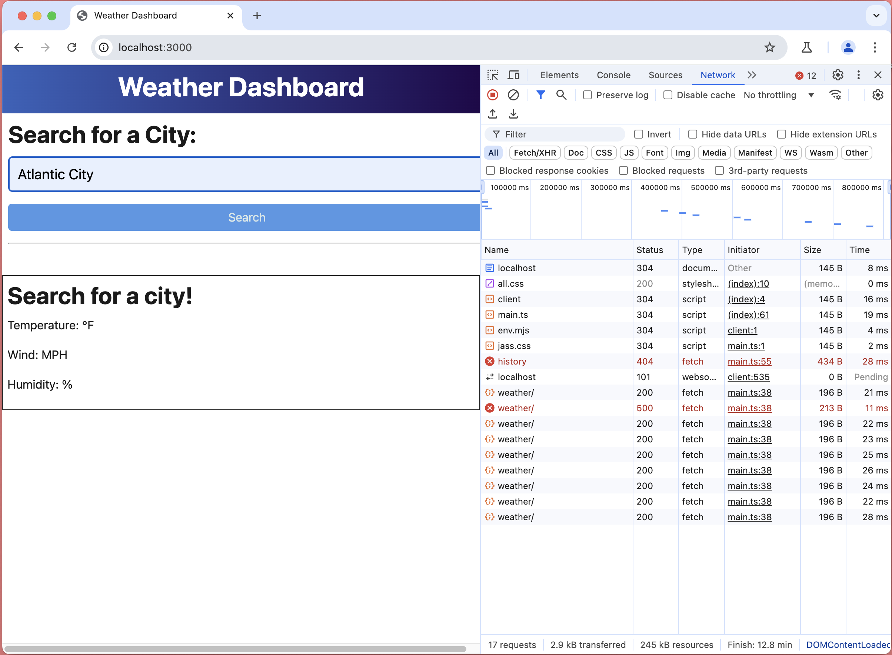

# Cities-Forecast-App

## Description
This project was created in hopes to provide a 5 day weather forecast to provide informative weather data. 

## Usage
As a user, I want a 5 day weather forecast, so that I can see the weather forecase in my area. 

## Support
Please contact Alex Balara for further assistance.

## Roadmap
This project has identified areas of improvement for this creators development in the area of Servers and APIs and therefore the creator was unable to generate the weather forecast for searched cities at this time despite exhausting all efforts.  It is the creators hope that with further practice and experience, this app will be able to run seamlessly display the weather forecast for searched cities. 

## Contributing
As a new member to the field, this creator not only welcomes but encourages feedback on enhancements to this project.

## Authors and Acknowledgements
This project was created by Alex Balara with the assistance and utilization of Xpert Learning Assistant, Copilot, and guidance from a tutor/professors which were crucial components to the understanding and building of this project.

## Visuals

## Links
Link to git hub repository
https://github.com/abalara4/Cities-Forecast-App.git

## License
None